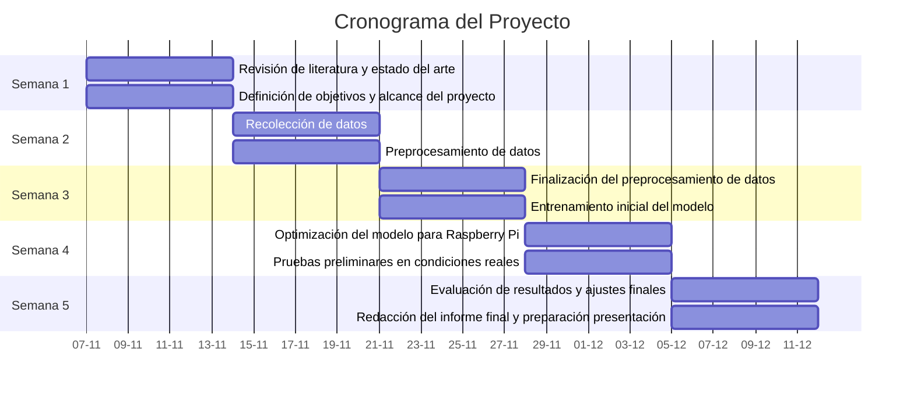

```mermaid
gantt
    title Cronograma del Proyecto
    dateFormat  YYYY-MM-DD
    axisFormat  %d-%m

    section Semana 1
    Revisión de literatura y estado del arte           :a1, 2024-11-07, 7d
    Definición de objetivos y alcance del proyecto     :a2, 2024-11-07, 7d

    section Semana 2
    Recolección de datos                             :b1, 2024-11-14, 7d
    Preprocesamiento de datos                        :b2, 2024-11-14, 7d

    section Semana 3
    Finalización del preprocesamiento de datos       :c1, 2024-11-21, 7d
    Entrenamiento inicial del modelo                 :c2, 2024-11-21, 7d

    section Semana 4
    Optimización del modelo para Raspberry Pi        :d1, 2024-11-28, 7d
    Pruebas preliminares en condiciones reales      :d2, 2024-11-28, 7d

    section Semana 5
    Evaluación de resultados y ajustes finales       :e1, 2024-12-05, 7d
    Redacción del informe final y preparación presentación :e2, 2024-12-05, 7d
```